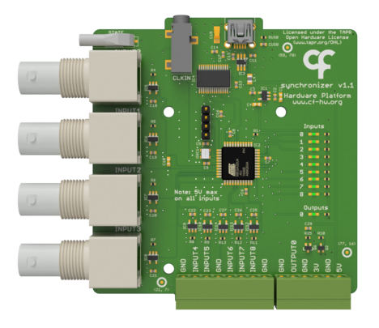

## Harp Synchronizer

Used to synchronize and align the different apparatus and devices present in a complex setup. It timestamps each rising or falling edge of the 9 digital input signals. The sampling of the inputs can also be configured to use a fixed sampling frequency.

### Key Features ###

* Receives and timestamps up to 9 digital input signals
* Sampling on signal transitions or fixed sampling frequency up to 2kHz

### Connectivity ###

* 1x clock sync input (CLKIN) [stereo jack]
* 1x USB (for computer) [USB type B]
* 9x digital inputs (DIN0 to DIN5) [BNC], (DIN6 to DIN8) [screw terminal]
* 1x digital output (DOUT0) [screw terminal]

## Interface ##

The interface with the Harp board can be done through [Bonsai](https://bonsai-rx.org/) or a dedicated GUI (Graphical User Interface).

In order to use this GUI, there are some software that needs to be installed:

1 - Install the [drivers](https://bitbucket.org/fchampalimaud/downloads/downloads/UsbDriver-2.12.26.zip).

2 - Install the [runtime](https://bitbucket.org/fchampalimaud/downloads/downloads/Runtime-1.0.zip).

3 - Reboot the computer.

4 - Install the [GUI](https://bitbucket.org/fchampalimaud/downloads/downloads/Harp%20Synchronizer%20v1.2.0.zip).

## Licensing ##

Each subdirectory will contain a license or, possibly, a set of licenses if it involves both hardware and software.
